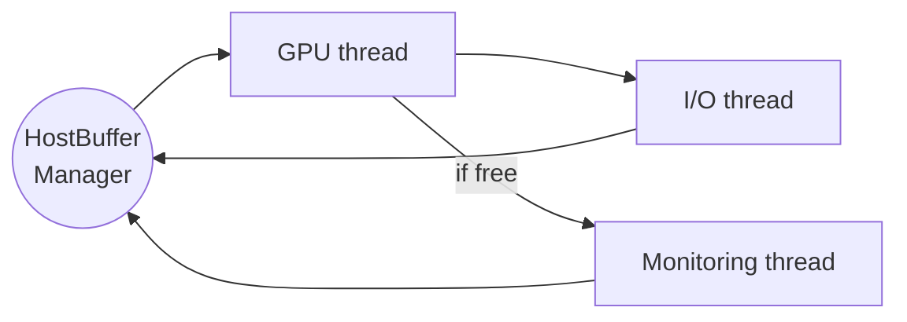

Allen: Adding a new CUDA algorithm
=====================================

This tutorial will guide you through adding a new CUDA algorithm to the `Allen` project.

SAXPY
-----

Writing an algorithm in CUDA in the `Allen` project is no different than writing it on any other GPU project. The differences are in how to invoke that program, and how to setup the options, arguments, and so on.

So let's assume that we have the following simple `SAXPY` algorithm, taken out from this website https://devblogs.nvidia.com/easy-introduction-cuda-c-and-c/

```clike=
__global__ void saxpy(float *x, float *y, int n, float a) {
  int i = blockIdx.x*blockDim.x + threadIdx.x;
  if (i < n) y[i] = a*x[i] + y[i];
}
```

### Adding the CUDA algorithm

We want to add the algorithm to a specific folder inside the `cuda` folder:

```
├── cuda
│   ├── CMakeLists.txt
│   └── velo
│       ├── CMakeLists.txt
│       ├── calculate_phi_and_sort
│       │   ├── include
│       │   │   └── CalculatePhiAndSort.cuh
│       │   └── src
│       │       ├── CalculatePhiAndSort.cu
│       │       ├── CalculatePhi.cu
│       │       └── SortByPhi.cu
│       ├── common
│       │   ├── include
│       │   │   ├── ClusteringDefinitions.cuh
│       │   │   └── VeloDefinitions.cuh
│       │   └── src
│       │       ├── ClusteringDefinitions.cu
│       │       └── Definitions.cu
...
```

Let's create a new folder inside the `cuda` directory named `test`. We need to modify `cuda/CMakeLists.txt` to reflect this:

```cmake=
add_subdirectory(velo)
add_subdirectory(test)
```

Inside the `test` folder we will create the following structure:

```
├── test
│   ├── CMakeLists.txt
│   └── saxpy
│       ├── include
│       │   └── Saxpy.cuh
│       └── src
│           └── Saxpy.cu
```

The newly created `test/CMakeLists.txt` file should reflect the project we are creating. We can do that by populating it like so:

```cmake=
file(GLOB test_saxpy "saxpy/src/*cu")
include_directories(saxpy/include)
include_directories(${CMAKE_SOURCE_DIR}/stream/gear/include)
include_directories(${CMAKE_SOURCE_DIR}/stream/setup/include)

add_library(Test STATIC
  ${test_saxpy}
)
```

Our CUDA algorithm `Saxpy.cuh` and `Saxpy.cu` will be as follows. Note we need to specify the required arguments in the `ALGORITHM`, let's give the arguments names that won't collide, like `dev_x` and `dev_y`:

```clike=
#include "Handler.cuh"
#include "ArgumentsCommon.cuh"

__global__ void saxpy(float *x, float *y, int n, float a);

ALGORITHM(saxpy, saxpy_t,
  ARGUMENTS(
    dev_x,
    dev_y
))
```

```clike=
#include "Saxpy.cuh"

__global__ void saxpy(float *x, float *y, int n, float a) {
  int i = blockIdx.x*blockDim.x + threadIdx.x;
  if (i < n) y[i] = a*x[i] + y[i];
}
```

The line with `ALGORITHM` encapsulates our algorithm `saxpy` into a class with name `saxpy_t`. We will use this class from now on to be able to refer to our algorithm.
Therefore, when developing algorithms for the HLT1 chain, please add the sub-detector that your algorithm belongs to in the name so that it can be easily identified within a sequence. For example: `velo_masked_clustering_t` or `ut_pre_decode_t`.

Lastly, edit `stream/CMakeLists.txt` and modify `target_link_libraries`:

```cmake
target_link_libraries(Stream Velo Test)
```

Ready to move on.

### Integrating the algorithm in the sequence

`Allen` centers around the idea of running a __sequence of algorithms__ on input events. This sequence is predefined and will always be executed in the same order.

Some events from the input will be discarded throughout the execution, and only a fraction of them will be kept for further processing. That is conceptually the idea behind the _High Level Trigger 1_ stage of LHCb, and is what is intended to achieve with this project.

Therefore, we need to add our algorithm to the sequence of algorithms. First, make the folder visible to CMake by editing the file `stream/CMakeLists.txt` and adding:

```clike
include_directories(${CMAKE_SOURCE_DIR}/cuda/test/saxpy/include)
```

Then, add the following include to `stream/setup/include/ConfiguredSequence.cuh`:

```clike
#include "Saxpy.cuh"
```

Now, we are ready to add our algorithm to a sequence. All available sequences live in the folder `configuration/sequences/`. The sequence to execute can be chosen at compile time, by appending the name of the desired sequence to the cmake call: `cmake -DSEQUENCE=DefaultSequence ..`. For now, let's just edit the `DefaultSequence`. Add the algorithm to `configuration/sequences/DefaultSequence.h` as follows:

```clike
/**
 * Specify here the algorithms to be executed in the sequence,
 * in the expected order of execution.
 */
SEQUENCE_T(
  ...
  prefix_sum_reduce_velo_track_hit_number_t,
  prefix_sum_single_block_velo_track_hit_number_t,
  prefix_sum_scan_velo_track_hit_number_t,
  consolidate_tracks_t,
  saxpy_t,
  ...
)
```

Keep in mind the order matters, and will define when your algorithm is scheduled. In this case, we have chosen to add it after the algorithm identified by `consolidate_tracks_t`.

Next, we need to define the arguments to be passed to our function. We need to define them in order for the dynamic scheduling machinery to properly work - that is, allocate what is needed only when it's needed, and manage the memory for us.

We will distinguish arguments just passed by value from pointers to device memory. We don't need to schedule those simply passed by value like `n` and `a`. We care however about `x` and `y`, since they require some reserving and freeing in memory.

In the algorithm definition we used the arguments `dev_x` and `dev_y`. We need to define the arguments, to make them available to our algorithm. Let's add these types to the common arguments, in `stream/setup/include/ArgumentsCommon.cuh`:

```clike
...
ARGUMENT(dev_x, float)
ARGUMENT(dev_y, float)
```

Optionally, some types are required to live throughout the whole sequence since its creation. An argument can be specified to be persistent in memory by adding it to the `output_arguments_t` tuple, in `AlgorithmDependencies.cuh`:

```clike
/**
 * @brief Output arguments, ie. that cannot be freed.
 * @details The arguments specified in this type will
 *          be kept allocated since their first appearance
 *          until the end of the sequence.
 */
typedef std::tuple<
  dev_atomics_storage,
  dev_velo_track_hit_number,
  dev_velo_track_hits,
  dev_atomics_veloUT,
  dev_veloUT_tracks,
  dev_scifi_tracks,
  dev_n_scifi_tracks
> output_arguments_t;
```

### Preparing and invoking the algorithms in the sequence

Now all the pieces are in place, we are ready to prepare the algorithm and do the actual invocation.

First go to `stream/sequence/include/HostBuffers.cuh` and add the saxpy host memory pointer:

```clike
  ...
    
  // Pinned host datatypes
  uint* host_velo_tracks_atomics;
  uint* host_velo_track_hit_number;
  uint* host_velo_track_hits;
  uint* host_total_number_of_velo_clusters;
  uint* host_number_of_reconstructed_velo_tracks;
  uint* host_accumulated_number_of_hits_in_velo_tracks;
  uint* host_accumulated_number_of_ut_hits;

  // Saxpy
  int saxpy_N = 1<<20;
  float *host_x, *host_y;

  ...
```

Reserve that host memory in `stream/sequence/src/HostBuffers.cu`:

```clike
  ...
    
  cudaCheck(cudaMallocHost((void**)&host_velo_tracks_atomics, (2 * max_number_of_events + 1) * sizeof(int)));
  cudaCheck(cudaMallocHost((void**)&host_velo_track_hit_number, max_number_of_events * VeloTracking::max_tracks * sizeof(uint)));
  cudaCheck(cudaMallocHost((void**)&host_velo_track_hits, max_number_of_events * VeloTracking::max_tracks * VeloTracking::max_track_size * sizeof(Velo::Hit)));
  cudaCheck(cudaMallocHost((void**)&host_total_number_of_velo_clusters, sizeof(uint)));
  cudaCheck(cudaMallocHost((void**)&host_number_of_reconstructed_velo_tracks, sizeof(uint)));
  cudaCheck(cudaMallocHost((void**)&host_accumulated_number_of_hits_in_velo_tracks, sizeof(uint)));
  cudaCheck(cudaMallocHost((void**)&host_veloUT_tracks, max_number_of_events * VeloUTTracking::max_num_tracks * sizeof(VeloUTTracking::TrackUT)));
  cudaCheck(cudaMallocHost((void**)&host_atomics_veloUT, VeloUTTracking::num_atomics * max_number_of_events * sizeof(int)));
  cudaCheck(cudaMallocHost((void**)&host_accumulated_number_of_ut_hits, sizeof(uint)));
  cudaCheck(cudaMallocHost((void**)&host_accumulated_number_of_scifi_hits, sizeof(uint)));
  
  // Saxpy memory allocations
  cudaCheck(cudaMallocHost((void**)&host_x, saxpy_N * sizeof(float)));
  cudaCheck(cudaMallocHost((void**)&host_y, saxpy_N * sizeof(float)));

  ...
```

Finally, create a visitor for your newly created algorithm. Create a containing folder structure for it in `stream/visitors/test/src/`, and a new file inside named `SaxpyVisitor.cu`. Insert the following code inside:

```clike
#include "SequenceVisitor.cuh"
#include "Saxpy.cuh"

template<>
void SequenceVisitor::set_arguments_size<saxpy_t>(
  saxpy_t::arguments_t arguments,
  const RuntimeOptions& runtime_options,
  const Constants& constants,
  const HostBuffers& host_buffers)
{
  // Set arguments size
  int saxpy_N = 1<<20;
  arguments.set_size<dev_x>(saxpy_N);
  arguments.set_size<dev_y>(saxpy_N);
}

template<>
void SequenceVisitor::visit<saxpy_t>(
  saxpy_t& state,
  const saxpy_t::arguments_t& arguments,
  const RuntimeOptions& runtime_options,
  const Constants& constants,
  HostBuffers& host_buffers,
  cudaStream_t& cuda_stream,
  cudaEvent_t& cuda_generic_event)
{
  // Saxpy test
  int saxpy_N = 1<<20;
  for (int i = 0; i < saxpy_N; i++) {
    host_buffers.host_x[i] = 1.0f;
    host_buffers.host_y[i] = 2.0f;
  }

  // Copy memory from host to device
  cudaCheck(cudaMemcpyAsync(
    arguments.offset<dev_x>(),
    host_buffers.host_x,
    saxpy_N * sizeof(float),
    cudaMemcpyHostToDevice,
    cuda_stream
  ));

  cudaCheck(cudaMemcpyAsync(
    arguments.offset<dev_y>(),
    host_buffers.host_y,
    saxpy_N * sizeof(float),
    cudaMemcpyHostToDevice,
    cuda_stream
  ));

  // Setup opts for kernel call
  state.set_opts(dim3((saxpy_N+255)/256), dim3(256), cuda_stream);
  
  // Setup arguments for kernel call
  state.set_arguments(
    arguments.offset<dev_x>(),
    arguments.offset<dev_y>(),
    saxpy_N,
    2.0f
  );

  // Kernel call
  state.invoke();

  // Retrieve result
  cudaCheck(cudaMemcpyAsync(
    host_buffers.host_y,
    arguments.offset<dev_y>(),
    arguments.size<dev_y>(),
    cudaMemcpyDeviceToHost,
    cuda_stream
  ));

  // Wait to receive the result
  cudaEventRecord(cuda_generic_event, cuda_stream);
  cudaEventSynchronize(cuda_generic_event);

  // Check the output
  float maxError = 0.0f;
  for (int i=0; i<saxpy_N; i++) {
    maxError = std::max(maxError, abs(host_buffers.host_y[i]-4.0f));
  }
  info_cout << "Saxpy max error: " << maxError << std::endl << std::endl;
}
```

As a last step, add the visitor to `stream/CMakeLists.txt`:

```clike
...
file(GLOB stream_visitors_test "visitors/test/src/*cu")
...
add_library(Stream STATIC
${stream_visitors_test}
...
```

We can compile the code and run the program `./Allen`. If everything went well, the following text should appear:

```
Saxpy max error: 0.00
```

The cool thing is your algorithm is now part of the sequence. You can see how memory is managed, taking into account your algorithm, and how it changes on every step by appending the `-p` option: `./Allen -p`

```
Sequence step 13 "saxpy_t" memory segments (MiB):
dev_velo_track_hit_number (0.01), unused (0.05), dev_atomics_storage (0.00), unused (1.30), dev_velo_track_hits (0.26), dev_x (4.00), dev_y (4.00), unused (1014.39), 
Max memory required: 9.61 MiB
```

Adding configurable parameters
==============================

To allow a parameter to be configurable via the JSON configuration interface, a `Property` must be
added to the corresponding `ALGORITHM` call. This makes uses of variadic macros so multiple `Property`
objects can be included and will be appended verbatim to the class definition written by the `ALGORITHM` macro.
For example, the following code will add two properties to the `search_by_triplet` algorithm:

```
ALGORITHM(search_by_triplet,
          velo_search_by_triplet_t,
          ARGUMENTS(
            dev_velo_cluster_container,
            ...
            dev_rel_indices),
          Property<float> m_tol {this,
                                 "forward_phi_tolerance",
                                 Configuration::velo_search_by_triplet_t::forward_phi_tolerance,
                                 0.052f,
                                 "tolerance"};
          Property<float> m_scat {this,
                                  "max_scatter_forwarding",
                                  Configuration::velo_search_by_triplet_t::max_scatter_forwarding,
                                  0.1f,
                                  "scatter forwarding"};
          )
```

The arguments passed to the `Property` constructor are
* the `Algorithm` that "owns" it;
* the name of the property in the JSON configuration;
* the underlying variable - this must be in `__constant__` memory for regular properties (see below);
* the default value of the property;
* a description of the property.

As the underlying parameters make use of GPU constant memory, they may not be defined within the
algorithm's class. They should instead be placed inside of namespace of the same name within the
`Configuration` namespace. For the example above, the following needs to be added to the header file:

```
namespace Configuration {
  namespace velo_search_by_triplet_t {
    // Forward tolerance in phi
    extern __constant__ float forward_phi_tolerance;
    // Max scatter for forming triplets (seeding) and forwarding
    extern __constant__ float max_scatter_forwarding;
  } // namespace velo_search_by_triplet_t
} // namespace Configuration
```

and the following to the code file:
```
__constant__ float Configuration::velo_search_by_triplet_t::forward_phi_tolerance;
__constant__ float Configuration::velo_search_by_triplet_t::max_scatter_forwarding;
```

Finally, the following can be added to the configuration file (default: `configuration/constants/default.json`)
to configure the values of these parameters at runtime:
```
"velo_search_by_triplet_t": {"forward_phi_tolerance" : "0.052", "max_scatter_forwarding" : "0.1"}
```

Derived properties
------------------

For properties derived from other configurable properties, the `DerivedProperty` class may be used:

```
Property<float> m_slope {this,
                         "sigma_velo_slope",
                         Configuration::compass_ut_t::sigma_velo_slope,
                         0.010f * Gaudi::Units::mrad,
                         "sigma velo slope [radians]"};
DerivedProperty<float> m_inv_slope {this,
                                    "inv_sigma_velo_slope",
                                    Configuration::compass_ut_t::inv_sigma_velo_slope,
                                    Configuration::Relations::inverse,
                                    std::vector<Property<float>*> {&this->m_slope},
                                    "inv sigma velo slope"};
```

Here, the value of the `m_inv_slope` property is determined by the function and the
vector of properties given in the third and fourth arguments. Additional functions
may be added to the `Configuration::Relations` and defined in `stream/gear/src/Configuration.cu`.
All functions take a vector of properties as an argument, to allow for functions of an
arbitrary number of properties.

CPU properties
--------------

Regular properties are designed to be used in GPU algorithms and are stored
in GPU constant memory with a cached copy within the `Property` class.
For properties that are only needed on the CPU, e.g. grid and block dimensions,
a `CPUProperty` can be used, which only stores the configured value internally.
This is also useful for properties tht are only needed when first configuring the
algorithm, such as properties only used in the visitor class.
Note that regular properties may also be used in this case
(e.g. `../stream/visitors/velo/src/SearchByTripletVisitor.cu` accesses non-CPU properties)
but if a property is *only* needed on the CPU then there is a reduced overhead in using a `CPUProperty`.

These are defined in the same way as a `Property` but take one fewer argument as there is no underlying
constant memory object to reference.

```
CPUProperty<std::array<int, 3>> m_block_dim {this, "block_dim", {32, 1, 1}, "block dimensions"};
CPUProperty<std::array<int, 3>> m_grid_dim {this, "grid_dim", {1, 1, 1}, "grid dimensions"};
```

Shared properties
-----------------

For properties that are shared between multiple top-level algorithms, it may be preferred
to keep the properties in a neutral location. This ensures that properties are configured
regardless of which algorithms are used in the configured sequence and can be achieved by
using a `SharedProperty`.

Shared properties are owned by a `SharedPropertySet` rather than an `Algorithm`
and example of which is given below.

```
#include "Configuration.cuh"

namespace Configuration {
  namespace example_common {
    extern __constant__ float param;
  }
}

struct ExampleConfiguration : public SharedPropertySet {
  ExampleConfiguration() = default;
  constexpr static auto name{ "example_common" };
private:
  Property<float> m_par{this, "param", Configuration::example_common::param, 0., "an example parameter"};
};
```

This may be used by any algorithm by including the header and adding the following line
to the end of the arguments of the `ALGORITHM` call.

```
SharedProperty<float> m_shared{this, "example_common", "param"};
```

These must also be plumbed in to `Configuration::getSharedPropertySet` in `stream/gear/src/Configuration.cu`
to allow the property set to be found by algorithms.

Adding monitoring histograms
============================

Overview
--------

Monitoring in Allen is performed by dedicated monitoring threads (by default there is a single thread). 
After a slice of data is processed, the `HostBuffers` corresponding to that slice are sent to the monitoring 
thread concurrent with being sent to the I/O thread for output. The flow of `HostBuffers` is shown below:



To avoid excessive load on the CPU, monitoring threads will not queue `HostBuffers`, i.e, if the 
monitoring thread is already busy then new `HostBuffers` will be immediately marked as monitored. 
Functionality exists within `MonitorManager` to reactively reduce the amount of monitoring performed 
(n.b. this corresponds to an **increase** in the `monitoring_level`) in response to a large number of skipped 
slices. This is not currently used but would allow monitoring to favour running *some* types of monitors 
for *all* slices over running *all* types of monitors for *some* slices. Additionally, less important monitors 
could be run on a random sub-sample of slices. The `MetaMonitor` provides monitoring histograms that track 
the numbers of successfully monitored and skipped slices as well as the monitoring level. 

Monitor classes
---------------

Additional monitors that produce histograms based on information in the `HostBuffers` should be added to 
`integration/monitoring` and inherit from the `BufferMonitor` class. The `RateMonitor` class provides an 
example of this. Furthermore, each histogram that is added must be given a unique key in MonitorBase::MonHistType. 

Once a new monitoring class has been written, this may be added to the monitoring thread(s) by including an instance 
of the class in the vectors created in `MonitorManager::init`, e.g.
```
m_monitors.back().push_back(new RateMonitor(buffers_manager, time_step, offset));
```

Saving histograms
-----------------

All histograms may be saved by calling `MonitorManager::saveHistograms`. This is currently performed once after 
Allen has finished executing. In principle, this could be performed on a regular basis within the main loop but 
ideally would require monitoring threads to be paused for thread safety. 

Histograms are currently written to `monitoringHists.root`.
